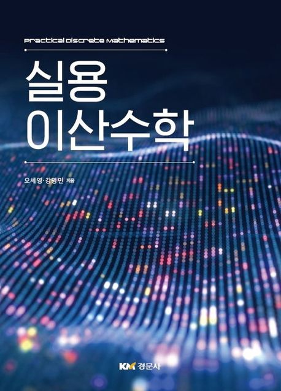

  
<h1 align="center">
  
실용 이산수학

  
</h1>
  
  
<b>오세영 , 강명민  저</b> 
경문사 · 2022년 03월 02일 출간</b>

## :bulb: 목표

- **SIMPLE: 이산 수학을 이해한다.**

  > 개념 공부와 연습 문제 풀이로 이산 수학을 이해하는 것에 초점을 둔다.

 

## :mag: 목차

### CHAPTER 01 함수, 알고리즘, 논리

1.1 함수 / 2

1.2 알고리즘 / 42

1.3 명제와 논리 / 57

1.4 증명 방법 / 74

### CHAPTER 02 정수와 암호

2.1 정수(Integers) / 100

2.2 소수(Prime numbers) / 122

2.3 암호 기술(Cryptography) / 147

### CHAPTER 03 경우의 수와 확률

3.1 경우의 수 세기 / 162

3.2 순열과 조합 / 188

3.3 분배와 분할 / 220

3.4 확률 / 240

### CHAPTER 04 그래프

4.1 그래프와 성질 / 250

4.2 완전 그래프와 평면형 그래프 / 265

4.3 트리(Tree) 그래프 / 283

4.4 경로 검색 알고리즘 / 296

4.5 오일러 회로와 해밀턴 사이클 / 325

### 부록 선형대수 기본

부록 1 행렬의 개념과 연산 / 346

부록 2 역행렬 / 353
