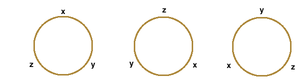

# 3.2 순열과 조합

## 3.2.1 Permutations(순열)

<U>순서가 부여된 임의의 집합(set)을 다른 순서로 뒤섞는 연산</U>이다.

즉, 정의역 = 공역인 **일대일 대응함수**(전단사 함수)이다.

$$ n! = n(n-1)(n-2)\cdots2\cdot1 $$

조합론에서는 더 많은 순열 개념을 사용한다. 이를테면 $P(n,k)$ 는 서로 다른 n개의 원소에서 k개의 원소를 골라 **'중복 없이'** **'순서에 상관 있게'** 나열하는 연산이다.

> 이를 따로 k-permutations(k-순열)이라고 부르기도 한다.

우선 예제를 보자.

 

### &nbsp;&nbsp;&nbsp;📝 예제 3.2.1&nbsp;&nbsp;&nbsp;

n 명의 사람이 일렬로 나열된 n 개의 의자에 앉을 수 있는 방법의 수는?

### &nbsp;&nbsp;&nbsp;🔍 풀이&nbsp;&nbsp;&nbsp;

> 순서가 부여된 집합(n 명의 사람)을 다른 순서로 뒤섞는 연산을 시행한다. 즉, permutations이다.

- 첫 번째 의자에 앉을 사람을 선택하는 방법은 n개

- 두 번째 의자는 n-1개

- 세 번째 의자는 n-2개

- 마지막 n 번째 의자는 한 사람밖에 없으므로 1가지 방법만 있다.

$$ n\times(n-1)\times(n-2)\times ... \times 2 \times 1 = n! $$

 

### &nbsp;&nbsp;&nbsp;📝 예제 3.2.2&nbsp;&nbsp;&nbsp;

1부터 10까지 숫자가 적힌 상자가 있다. 이 상자에 3개의 공(각각 빨강, 파랑, 노랑)을 나눠서 담으려고 한다. 각 상자에는 공을 하나만 담을 수 있을 때 상자에 공을 담을 수 있는 방법의 수는 얼마나 되는가?

### &nbsp;&nbsp;&nbsp;🔍 풀이&nbsp;&nbsp;&nbsp;

> 순서가 부여된 집합(10 개의 상자)에서 k개(3 개)를 뽑아 (순서에 상관 있게) 배열하는 연산을 시행한다. 즉 permutations이다.

- 빨강색 공이 들어갈 수 있는 상자는 1~10번 상자까지 총 10가지가 경우가 존재.

- 빨강 공을 담은 뒤 파랑 공이 들어갈 수 있는 상자는 9가지

- 마지막 노랑은 빨강, 파랑 공이 들어가지 않은 상자로 8가지

$$ 10 \times 9 \times 8 = 720 $$

 

예제 3.2.2는 일반화할 수 있다. '공이 한 개씩만 들어갈 수 있는 n개의 번호가 적힌 상자에 r개의 서로 다른 색의 공을 넣을 수 있는 방법의 수'다.

- 첫 번째 공을 n개의 상자에 넣을 수 있는 방법: n가지

- 두 번째 공을 n-1개의 상자에 넣을 수 있는 방법: (n-1)가지

- ...

- 마지막 r번째 공을 n-r+1개의 상자에 넣을 수 있는 방법: (n-r+1)가지

위 식을 간단히 $P(n,k)$ 이라고 정의한다.

$$ p(n, k) = {n! \over (n-k)!} $$

 

### 3.2.1.1 permutation with repetitions(중복순열)

<U>서로 다른 n개의 원소 집합(set)에서 **중복을 허용**해서 k개를 뽑아서 나열하는 연산</U>이다. 이를테면 n개의 원소 중 하나만으로 k개를 뽑을 수 있는 것이다.

$$ \Pi (n,k) = n^{k} $$

예제 3.2.2를 중복순열로 바꾼다면, 하나의 상자에 하나의 공만이 아닌 3개를 모두 담을 수 있는 경우라고 볼 수 있다. 그 방법의 수는 다음과 같다.

$$ 10 \times 10 \times 10 = 1000 $$

 

### 3.2.1.2 전사함수(onto function)의 개수 $O(r, n)$

onto function(전사함수)는 공역과 치역이 같은 함수였다. 이는 다음 두 가지 의미로 해석할 수 있다.

- <U>r개 원소를 갖는 집합을 n개의 부분집합으로 나누어 나열</U>하는 방법의 수

- r개 원소의 집합과 n개 원소의 집합이 이루는 <U>전사함수의 개수</U>

이 경우 $r, n$ 이 $r \ge n$ 이냐 혹은 $r < n$ 이냐에 따라 계산이 달라지게 된다. 표기도 $r$ 이 앞서는 경우도 $r$ 이 $n$ 보다 커야 사실상 $O(r,n)$ 이 의미가 있기 때문이다.

> 에초에 $r < n$ 이면 에초에 전사함수가 성립할 수 없으므로 $O(r, n)=0$ 이다.

예를 들어 예제 3.2.2에서 10개의 모든 상자가 반드시 1개 이상 공을 담아야 한다는 조건을 추가하면 결과가 달라지게 된다.

> $O(r, n)$ 는 combination 개념 설명 후 다시 살펴볼 것이다.

 

### 3.2.1.3 부분중복수열

$n_1, n_2, n_3, ..., n_k$ 개의 <U>중복되는 원소를 가진 n개의 원소를 갖는 집합에서 r개를 뽑아 일렬로 나열하는 중복수열의 수</U>이다. 이를테면 a, a, b를 일렬로 나열하는 permutation을 생각해 보면, aab, aba, baa로 세 가지이다.( ${{3!} \over {2!}}$ )

$$ \left( \overbrace{a_1,\,a_1,\, \cdots\cdots,\, a_1}^{\rm n_1},\, \overbrace{a_2,\,a_2,\, \cdots\cdots,\, a_2}^{\rm n_2},\, \cdots\cdots,\, \overbrace{a_k,\, a_k,\, \cdots\cdots,\, a_k}^{{\rm n}_k} \right)$$

$$ = \frac{\displaystyle \left( \sum_{i=1}^k {\rm n}_i \right)!}{\displaystyle \prod_{i=1}^k ({\rm n}_i!)} = \dfrac{({\rm n}_1 +{\rm n}_2 +\cdots +{\rm n}_k)!}{{\rm n}_1! \times {\rm n}_2! \times \cdots\times {\rm n}_k!} $$

> 간단하게 모든 원소의 개수만큼 permutation을 적용한 값에, 각 중복별로 permutation을 적용한 값들의 곱을 나눈 것이다.

이해를 위해 예제 3.2.2를 다시 변형해 보자. 

- 빨강 2 / 파랑 1 / 노랑 1

서로 다른 10개의 상자에 한 개의 공을 넣을 수 있다. 그런데 이번에는 빨간색 공을 2개로 설정하자. 그리고 빨간색 중 하나는 옅은 빨강이고, 다른 하나는 짙은 빨강으로 구별이 가능하다.

우선 이를 구별한다면 기본적으로 $P(10,4) = 5040$ 이 된다. 여기서 다음과 같이 조건을 바꾸면 부분중복수열이 된다. 빨간색 공 2개를 서로 구분할 수 없다고 가정하자. 그렇다면 경우는 2로 나눈 $P(10,4) / 2 = 5040/2 = 2520$ 이 된다. 

- 빨강 3 / 파랑 2 / 노랑 1

좀 더 늘려보자. 빨간 공 3개, 파란 공 2개, 노랑 공 1개다. 모두가 구별이 된다면 $P(10, 6)$ 가지 방법이 있겠으나, 그러나 구분을 할 수 없다면 그렇지 않다. 3개의 공을 구분한 방법은 $3!$ , 2개의 공을 구분한 방법은 $2!$ 이므로, 같은 색상의 공을 구분할 수 없다면 다음과 같이 계산할 수 있다.

$$ { {P(10, 6)} \over {3! \times 2!} } $$

예제의 공식을 일반화하면 다음과 같다. 

$$ {{P(n,r)} \over {r_1! \times r_2! \times \cdots \times r_k!} } $$

 

### 3.2.1.4 원 순열

순서가 부여된 <U>집합(n개 원소)을 다른 순서로 나열하는데, 원형으로 나열하는 경우</U>를 말한다. 

주의할 점은 아래 3가지 방법은 원을 회전하게 되면 모두 같은 나열이라 볼 수 있다.

달리 말하면 원소의 개수만큼 나열이 모두 같은 것이므로 일반 permutations에 n으로 나누어 주면 된다.

$$ {n! \over n} = (n-1)! $$

n개 중 r개를 뽑아서 원형으로 나열해도, r개만큼 중복이 있으므로 r로 나누면 된다.

$$ {{P(n, r)} \over r} $$

- 반전까지 가능한 경우(열쇠고리 모양)

만약 열쇠고리에 모양에 나열하고, 뒤집을 수 있다면 조금 조건이 달라진다. 하지만 어렵게 생각할 것 없이 모든 나열에 거울의 비친 모습의 나열이 하나씩 존재할 것이므로, 2를 나누면 된다.

$$ {n! \over n} \times {1 \over 2} = {{(n-1)!} \over 2}  $$

---

## 3.2.2 Combination(조합)

서로 다른 n개의 원소를 갖는 집합(set)에서 **순서에 상관없이** r개의 원소를 선택하는 것이다.

이전에 한 예제를 변형해 보자. 1에서 10번까지 상자가 있는데, 이번에는 빨간색 공만 3개가 있고 오직 상자에는 1개만 담을 수 있다. 이 경우 중복순열의 방법을 적용하면 다음과 같다.

$$ {{P(10, 3)} \over {3!}} $$

사실상 이것이 combination의 핵심이다. 

$$ C(n, r) = {{P(n, r)} \over {r!}} = {{n!} \over {r!(n-r)!}} $$

이는 이항계수 $\left( \frac{n}{r} \right)$ 과 값이 완전히 같다. 실제로 이 둘을 혼용하기도 한다.

> 이항계수는 $(a+b)^n$ 꼴의 다항식을 전개했을 때, $a^rb^{n-r} (0 \le r \le n)$ 의 계수를 뜻했다. 

> 전체 집합은 n개의 원소가 있으며, 그 중에서 a와 b가 중복일 때의 순열 개념에 가깝다. 예를 들어 $a^{n}$ 은 n개의 원소가 모두 a로 중복인 경우이다. 반면 $a^1b^{n-1}$ 은 a가 1개 있고, 나머지 중복되는 b가 n-1개 있는 경우이다.

또한 서로 다른 $n$ 개의 원소로 구성된 집합 중 $r$ 개 ( $r \le n$ )로 구성된 부분집합의 개수는 $C(n, r)$ 이다.

또한 서로 다른 n개의 원소 중 r개를 뽑는 것은 n-r개를 뽑는 것과 동일하다. 따라서 다음 식이 성립한다.

$$ C(n, r) = C(n, n-r) $$

 

### 3.2.2.1 combinations with repetition(중복조합)

<U>n개의 원소에서 r개를 **순서에 상관없이** 뽑는데, **중복을 허락**</U>할 때의 경우이다.

다시 예제를 바꿔 보자. 1~3까지 적힌 상자에 한 개 이상의 공을 넣을 수 있는데, 이때 5개의 구별되지 않는 빨간 공을 나눠 담을 것이다.

여기서 **칸막이** 개념을 생각하면 편리하다. 다섯 개의 같은 공 사이에 2개의 칸막이를 넣는 것으로 3개의 그룹으로 나눌 수 있다.

- 이는 다른 말로 하면 5개의 중복(공), 2개의 중복(칸막이)이 있는 집합을 나열하는 것과 같다.

$$ {7! \over {5! \times 2!} }= 21 $$

다른 방식으로 생각할 수 있다. 세 개의 서로 다른 물건을 중복해서 다섯 개로 만드는 방법으로도 볼 수 있다.

> 3개의 원소에서 5개를 순서에 상관 없이 뽑는다. $H(3,5)$

$$ 1, 1, 1, 2, 3 $$

이런 방법을 중복조합이라고 하며, $H(n, r)$ 또는 $_{n}\mathrm{H}_{r}$ 로 나타낸다.

$$ H(n,r) = {{(n+r-1)!} \over {r!(n-1)!}} $$

 

### &nbsp;&nbsp;&nbsp;💾 정리 3.2.1: 전사함수의 개수&nbsp;&nbsp;&nbsp;

이제 3.2.1.2절에서 다룬 전사함수의 개수를 정리할 수 있다. 

$$ O(r,n) = \sum_{i = 0}^{n}{(-1)^i C(n,i)(n-i)^r} $$

- 집합 $A,B$ 는 $f: A \rightarrow B$ 는 $f(A) = B$ 를 만족하는 onto function(전사함수)다.

- 정의역: $A = \lbrace 1,2,3, \cdots, r \rbrace$

- 치역: $B = \lbrace 1,2,3, \cdots, n \rbrace$ , 이때 $r \ge n$ 를 만족한다.

### &nbsp;&nbsp;&nbsp;🔍 증명&nbsp;&nbsp;&nbsp;

먼저 전사함수의 개수가 어떤 문제인지 파악하자. 우선 전사함수이므로 $r \ge n$ 즉, 함수 $A$ (정의역)의 원소 개수 $r$ 가, 함수 $B$ (치역)의 원소 개수 $n$ 보다 많다.

> 우선 모든 가능한 연결은 n개의 서로 다른 치역 원소를 중복을 허락해서 r개까지 순서에 상관 있게 뽑는 것과 비슷하다.(중복순열) = $n^r$

그런데 제한 조건이 있다. 전사함수가 되기 위해서는 치역의 모든 n개 원소가 한 번씩은 나열되어야 한다. 즉, 모든 경우에서 사영 $f(A)$ 가 $B$ 의 부분집합인 경우를 제외해야 한다.

치역의 원소이면서 $A$ 와 연결되지 않는 원소들의 집합, 다시 말해 '치역 $i \in B$ 가 포함되지 않은 함수들의 집합'을 $B_i$ 라고 하자.

$$ B_i = \lbrace f|f : A \rightarrow B , i \in B - f(A) \rbrace $$

전사함수의 개수는 모든 가능한 연결의 개수에서, $B_i$ 집합들의 개수를 빼서 다음과 같이 표현할 수 있다.

$$ O(r, n) = n^r - |\cup_{i=1}^n B_i| $$

다음과 같은 방식으로 합집합의 원소 개수를 뺄 수 있을 것이다.

- 치역에서 1개의 원소( $_{n}\mathrm{C}_{1}$ )가 연결되지 않는 모든 연결의 개수 ( $(n-1)^r$ ) 를 빼줘야 한다.

- 그런데 치역에서 2개의 원소 ( $_{n}\mathrm{C}_{2}$ ) 가 연결되지 않는 경우는 위에서 구한 경우에 포함이 되어 있을 것이다. 위에서 중복하여 제거한만큼 다시 더해준다.

- 치역에서 3개의 원소 ( $_{n}\mathrm{C}_{3}$ ) 가 연결되지 않는 경우는 위에서 구한 경우에 포함이 되어 있다. 위에서 중복하여 포함한만큼 다시 빼준다.

- ...

- 이렇게 포함 배제 원리를 이용하여 식을 구성한다.

이제 $|\cup_{i=1}^n B_i|$ 에 포함 배제의 원리 적용하며 전개해 보자.

$|\cup_{i=1}^n B_i|$ 에 포함 배제의 원리를 적용하면 아래와 같이 쓸 수 있다.

$|\cup_{i=1}^n B_i| = \sum_{i=1}^n{|B_i|} - \sum_{1 \le i < j \le n}{|B_i \cap B_j|} \\
\quad \quad \quad\quad \quad + \sum_{i < j < k}{|B_i \cap B_j \cap B_k|} - \cdots (-1)^{n-1}|\cap_{i=1}^n{B_i}|$

각 항을 보면

$|B_i| = (n-1)^r, \quad i=1,2,\cdots,n$

$|B_i \cap B_j| = (n-2)^r, \quad i,j=1,2,\cdots,n, \quad i < j$

$|B_i \cap B_j \cap B_k| = (n-3)^r, \quad i,j,k=1,2,\cdots,n, \quad i < j < k$

$\quad \quad \vdots$ 

$|\cap_{i=1}^n B_i| = (n-n)^r = 0$

이며, n개 원소 집합에서 i개 원소를 갖는 부분집합의 수는 $C(n, i)$ 이다. 따라서 수식은 다음과 같이 쓸 수 있다.

$$ O(r, n) = n^r - \sum_{i=1}^{n}{(-1)^{i-1}C(n,i)(n-i)^r} $$

$$ = \sum_{i=0}^{n}{(-1)^{i}C(n,i)(n-i)^r} $$

---